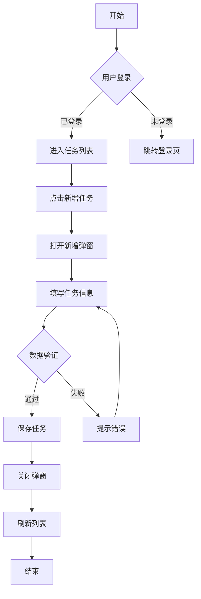

# 产品需求文档 (PRD) 编写指南

## 一、文档结构大纲

### 1. 文档基本信息

```markdown
## 文档信息

- 产品名称：[产品/功能名称]
- 文档版本：v1.0.0
- 创建日期：YYYY-MM-DD
- 最后更新：YYYY-MM-DD
- 产品经理：[姓名]
- 相关干系人：[开发、设计、测试等]
```

### 2. 标准文档结构

```markdown
# 产品需求文档 - [产品/功能名称]

## 1. 概述

### 1.1 项目背景

### 1.2 产品目标

### 1.3 需求范围

### 1.4 名词解释

## 2. 用户分析

### 2.1 目标用户

### 2.2 用户画像

### 2.3 使用场景

## 3. 需求分析

### 3.1 需求列表

### 3.2 需求优先级

### 3.3 业务流程图

## 4. 功能需求

### 4.1 功能模块划分

### 4.2 功能详细说明

#### 4.2.1 [功能模块 1]

- 功能描述
- 前置条件
- 后置条件
- 基本流程
- 异常流程
- 界面原型
- 交互说明

#### 4.2.2 [功能模块 2]

...

## 5. 非功能需求

### 5.1 性能需求

### 5.2 安全需求

### 5.3 兼容性需求

### 5.4 可用性需求

## 6. 数据需求

### 6.1 数据埋点

### 6.2 数据统计

### 6.3 数据迁移

## 7. 运营需求

### 7.1 上线计划

### 7.2 推广策略

### 7.3 培训计划

## 8. 风险评估

### 8.1 技术风险

### 8.2 业务风险

### 8.3 应对方案

## 9. 附录

### 9.1 参考资料

### 9.2 变更记录
```

---

## 二、各章节详细说明

### 1. 概述

#### 1.1 项目背景

- 说明为什么要做这个产品/功能
- 描述当前的问题或痛点
- 阐述市场环境和竞争态势
- 提供相关数据支撑

**示例：**

```markdown
### 1.1 项目背景

随着用户任务管理需求的日益复杂，现有系统仅支持单一类型的任务创建，无法满足用户对年度、月度、日度等多维度任务规划的需求。
根据用户调研数据显示，78% 的用户希望能够在统一平台管理不同周期的任务。
```

#### 1.2 产品目标

- 明确产品要达成的业务目标
- 设定可量化的成功指标（OKR/KPI）
- 区分短期目标和长期目标

**示例：**

```markdown
### 1.2 产品目标

**业务目标：**

- 提升用户任务完成率 30%
- 增加用户日均使用时长至 15 分钟
- 用户留存率提升至 60%

**成功指标：**

- 新增任务创建率 ≥ 50%
- 任务类型分布均衡（年度：月度：日 = 3:4:3）
```

#### 1.3 需求范围

- 明确包含的功能（In Scope）
- 明确不包含的功能（Out of Scope）
- 界定边界，避免需求蔓延

#### 1.4 名词解释

- 解释文档中出现的专业术语
- 统一团队认知，避免歧义

---

### 2. 用户分析

#### 2.1 目标用户

- 描述产品的目标用户群体
- 用户分类（如：新用户、活跃用户、付费用户等）

#### 2.2 用户画像

- 创建典型用户角色（Persona）
- 包含：年龄、职业、使用习惯、痛点等

**示例：**

```markdown
### 2.2 用户画像

**用户角色：职场精英 - 李明**

- 年龄：28 岁
- 职业：互联网公司产品经理
- 使用场景：工作日通勤路上规划当天任务，周末规划下周任务
- 痛点：任务类型繁多，难以区分优先级，容易遗漏重要事项
```

#### 2.3 使用场景

- 描述用户在什么情况下使用产品
- 使用 Story 形式叙述
- 包含：时间、地点、人物、事件、原因

---

### 3. 需求分析

#### 3.1 需求列表

使用表格形式列出所有需求：

| 需求编号 | 需求名称     | 需求描述                   | 优先级 |
| -------- | ------------ | -------------------------- | ------ |
| REQ-001  | 新增年度任务 | 用户可以创建年度级别的任务 | P0     |
| REQ-002  | 新增月度任务 | 用户可以创建月度级别的任务 | P0     |
| REQ-003  | 新增日任务   | 用户可以创建日级别的任务   | P0     |

#### 3.2 需求优先级

- P0：必须实现，核心功能
- P1：应该实现，重要功能
- P2：可以实现，锦上添花
- P3：暂缓实现，未来规划

#### 3.3 业务流程图

- 使用流程图展示业务逻辑
- 可使用工具：Draw.io、ProcessOn、Visio
- 包含：开始、结束、判断、处理节点

---

### 4. 功能需求（核心章节）

#### 4.1 功能模块划分

- 按功能模块组织文档结构
- 每个模块独立成节
- 模块间关系清晰

#### 4.2 功能详细说明

**每个功能点必须包含以下要素：**

##### 功能描述

- 用简洁的语言描述功能是什么
- 说明功能的价值和用途

##### 前置条件

- 用户需要满足的条件（如：已登录、有权限等）
- 系统需要满足的条件（如：数据已准备等）

##### 后置条件

- 功能执行后的系统状态
- 数据变化说明

##### 基本流程（Happy Path）

- 描述正常情况下的操作流程
- 使用步骤化描述
- 配合流程图或时序图

##### 异常流程（Exception Path）

- 列举所有可能的异常情况
- 说明每种异常的处理方式
- 包含错误提示文案

##### 界面原型

- 插入 UI 设计稿或原型图
- 图片命名规范，使用英文文件名
- 图片路径使用相对路径 `./img/xxx.png`

##### 交互说明

- 描述用户操作方式（点击、滑动、输入等）
- 说明交互反馈（动画、提示、跳转等）
- 标注特殊交互逻辑

**示例：**

```markdown
#### 4.2.1 新增任务弹窗

**功能描述：**
用户可以通过新增任务弹窗创建不同类型的任务，包括年度任务、月度任务、日任务。

**前置条件：**

- 用户已登录系统
- 用户具有任务创建权限

**后置条件：**

- 任务数据保存成功
- 任务列表刷新显示新任务
- 相关统计数据更新

**基本流程：**

1. 用户点击左侧导航栏"新增任务"按钮
2. 系统弹出新增任务弹窗
3. 用户选择任务类型（年度/月度/日）
4. 用户填写任务信息（标题、描述、时间等）
5. 用户点击"确认"按钮
6. 系统验证数据合法性
7. 系统保存任务数据
8. 系统关闭弹窗，刷新任务列表

**异常流程：**
| 异常场景 | 处理方式 | 提示文案 |
|---------|---------|---------|
| 任务标题为空 | 阻止提交，高亮必填项 | "任务标题不能为空" |
| 任务标题超过 50 字 | 阻止提交，聚焦输入框 | "任务标题不能超过 50 个字" |
| 网络请求失败 | 保留表单数据，提示重试 | "网络异常，请重试" |
| 服务器错误 | 保留表单数据，提示稍后重试 | "服务器繁忙，请稍后重试" |

**界面原型：**


**交互说明：**

- 任务类型选择：单选框，默认选中"日任务"
- 任务标题输入：文本输入框，限制 50 字，显示字数统计
- 任务描述：多行文本框，可选填，限制 200 字
- 时间选择器：根据任务类型动态变化
  - 年度任务：年份选择器
  - 月度任务：年月选择器
  - 日任务：日期时间选择器
- 确认按钮：点击后显示 loading 状态，接口返回后恢复
- 取消按钮：点击后关闭弹窗，不保存数据
- 表单验证：实时验证 + 提交时验证
```

---

### 5. 非功能需求

#### 5.1 性能需求

- 页面加载时间：< 3 秒
- 接口响应时间：< 500ms
- 并发支持：≥ 1000 QPS
- 数据量支持：≥ 100 万条记录

#### 5.2 安全需求

- 用户认证：必须登录才能访问
- 权限控制：基于角色的访问控制（RBAC）
- 数据加密：敏感数据加密存储
- 防攻击：XSS、CSRF、SQL 注入防护

#### 5.3 兼容性需求

- 浏览器：Chrome、Firefox、Safari、Edge（最新 2 个版本）
- 移动端：iOS 12+、Android 8+
- 屏幕分辨率：支持 1920x1080、1366x768、移动端适配

#### 5.4 可用性需求

- 系统可用性：≥ 99.9%
- 容错机制：关键操作支持撤销
- 错误恢复：异常情况自动恢复或提示
- 无障碍：支持键盘操作、屏幕阅读器

---

### 6. 数据需求

#### 6.1 数据埋点

```markdown
| 事件名称         | 事件 ID            | 触发时机             | 埋点参数             |
| ---------------- | ------------------ | -------------------- | -------------------- |
| 点击新增任务按钮 | click_add_task     | 用户点击新增任务按钮 | 无                   |
| 打开新增任务弹窗 | open_add_dialog    | 弹窗成功打开         | 来源位置             |
| 提交新增任务     | submit_task        | 用户点击确认按钮     | 任务类型、填写字段数 |
| 新增任务成功     | task_created       | 任务创建成功         | 任务 ID、任务类型    |
| 新增任务失败     | task_create_failed | 任务创建失败         | 失败原因、任务类型   |
```

#### 6.2 数据统计

- 需要统计的核心指标
- 数据报表需求
- 数据可视化需求

#### 6.3 数据迁移

- 老数据迁移方案
- 数据兼容性处理
- 数据回滚方案

---

### 7. 运营需求

#### 7.1 上线计划

- 灰度发布策略
- 全量发布时间
- 上线检查清单

#### 7.2 推广策略

- 产品内引导
- 用户通知方式
- 帮助文档更新

#### 7.3 培训计划

- 客服培训计划
- 销售培训计划
- 内部培训计划

---

### 8. 风险评估

#### 8.1 技术风险

- 技术难点分析
- 依赖的外部系统
- 技术债务评估

#### 8.2 业务风险

- 市场变化风险
- 竞争对手动态
- 法律法规风险

#### 8.3 应对方案

- 风险规避措施
- 风险缓解方案
- 应急预案

---

### 9. 附录

#### 9.1 参考资料

- 相关文档链接
- 竞品分析报告
- 用户调研报告

#### 9.2 变更记录

```markdown
| 版本   | 日期       | 修改人 | 修改内容     | 审核人 |
| ------ | ---------- | ------ | ------------ | ------ |
| v1.0.0 | 2026-04-01 | [姓名] | 初始版本     | [姓名] |
| v1.0.1 | 2026-04-02 | [姓名] | 修改功能说明 | [姓名] |
```

---

## 三、注意事项

### 1. 文档编写规范

#### 1.1 文件命名

- 使用中文文件名，清晰表达文档内容
- 添加序号前缀，便于排序：`01.新增任务功能设计.md`
- 避免使用特殊字符：`/\:*?"<>|`

#### 1.2 图片使用

- 图片统一放在 `./img/` 文件夹
- 使用英文文件名：`add-task-dialog.png`
- 使用相对路径引用：`./img/add-task-dialog.png`
- 为图片添加有意义的 alt 文本

#### 1.3 版本控制

- 使用 Git 管理文档版本
- 每次修改提交时写清晰的 commit message
- 重要变更在变更记录中说明

### 2. 内容编写要点

#### 2.1 表达清晰

- ✅ 使用简洁明了的语言
- ✅ 避免歧义和模糊表述
- ✅ 使用主动语态
- ❌ 避免"可能"、"大概"、"应该"等模糊词汇

#### 2.2 结构完整

- 每个功能点必须包含完整要素
- 流程图、原型图配合文字说明
- 异常场景必须覆盖完整

#### 2.3 逻辑严谨

- 前置条件、后置条件清晰
- 业务流程闭环
- 边界情况考虑周全

### 3. 协作注意事项

#### 3.1 与开发协作

- 需求评审前完成文档初稿
- 预留充足的技术评审时间
- 及时响应开发疑问，更新文档

#### 3.2 与设计协作

- 提前沟通设计理念
- 提供完整的功能说明
- 确认交互细节后更新文档

#### 3.3 与测试协作

- 提供完整的测试用例输入
- 明确验收标准
- 参与测试用例评审

### 4. 文档维护

#### 4.1 更新时机

- 需求变更时立即更新
- 开发过程中发现文档问题及时修正
- 版本发布后同步更新变更记录

#### 4.2 版本管理

- 小改动更新版本号（v1.0.1）
- 大改动更新主版本号（v1.1.0）
- 保持历史版本可追溯

#### 4.3 文档归档

- 已上线功能的文档标记状态
- 废弃需求说明原因和日期
- 定期整理文档结构

---

## 四、常用模板

### 流程图模板（使用 Mermaid）



### 表格模板

| 字段名      | 类型   | 必填 | 默认值 | 说明     | 校验规则       |
| ----------- | ------ | ---- | ------ | -------- | -------------- |
| title       | String | 是   | 无     | 任务标题 | 1-50 字符      |
| type        | Enum   | 是   | day    | 任务类型 | year/month/day |
| description | String | 否   | 空     | 任务描述 | 最多 200 字符  |

---

## 五、总结

一份优秀的产品需求文档应该具备：

1. **结构清晰**：按照标准大纲组织内容
2. **内容完整**：覆盖所有功能点和异常场景
3. **表达准确**：无歧义、无模糊表述
4. **易于理解**：图文并茂，降低理解成本
5. **可执行性强**：开发、设计、测试都能从中获取所需信息
6. **可维护性好**：版本清晰，便于后续更新

记住：**文档是沟通的工具，不是目的**。根据团队实际情况调整文档详略程度，确保文档真正发挥作用。
