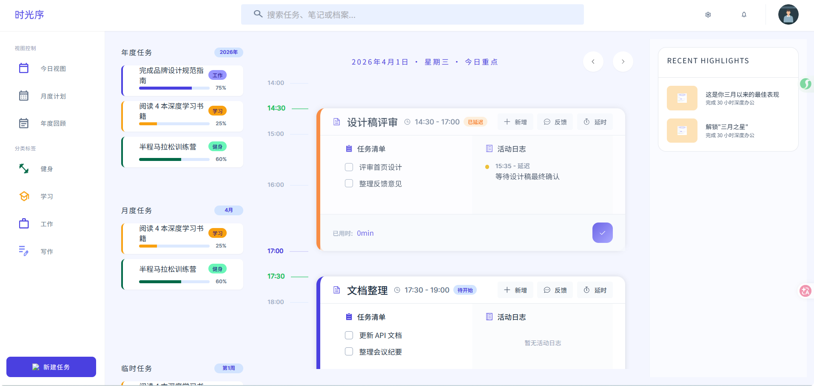

# 日视图页面



## 页面概述

日视图页面是LifePlan应用的核心功能页面，用于展示和管理用户每日的任务安排。页面采用三栏布局设计，提供直观的时间线视图，帮助用户高效规划和追踪日常任务。

## 页面布局

### 整体结构

页面采用三栏布局：

| 区域     | 位置 | 宽度     | 功能描述                     |
| -------- | ---- | -------- | ---------------------------- |
| 左侧边栏 | 左侧 | 固定宽度 | 展示年度、月度、临时任务列表 |
| 主内容区 | 中间 | 自适应   | 时间线任务管理区域           |
| 右侧边栏 | 右侧 | 固定宽度 | 展示近期成就亮点             |

---

## 功能模块详解

### 一、左侧边栏 - 任务卡片列表

#### 1.1 年度任务卡片

- **标题**：显示"年度任务"，右上角显示当前年份标签（如"2026年"）
- **内容**：展示年度级别的任务列表
- **任务项信息**：
  - 任务标题
  - 任务分类标签（工作/学习/健身等，不同颜色区分）
  - 进度条及完成百分比

#### 1.2 月度任务卡片

- **标题**：显示"月度任务"，右上角显示当前月份标签（如"4月"）
- **内容**：展示本月计划任务
- **展示形式**：与年度任务卡片一致

#### 1.3 临时任务卡片

- **标题**：显示"临时任务"，右上角显示当前周数标签（如"第1周"）
- **内容**：展示临时性、短期任务
- **展示形式**：与年度任务卡片一致

---

### 二、主内容区 - 时间线视图

#### 2.1 顶部导航栏

- **日期显示**：格式为"YYYY年MM月DD日 · 星期X · 今日重点"
- **导航按钮**：
  - 左箭头按钮：切换到前一天
  - 右箭头按钮：切换到后一天

#### 2.2 时间刻度

- **时间范围**：07:00 - 23:00
- **刻度间隔**：每小时一个整点刻度
- **刻度样式**：
  - 整点时间标签（如 07:00、08:00）
  - 水平时间线
  - 任务边界刻度（非整点任务开始/结束时间）

#### 2.3 任务卡片（DayTaskCard）

##### 卡片头部

- **左侧区域**：
  - 任务图标
  - 任务标题
  - 时间范围（如"07:00 - 09:30"）
  - 状态标签（进行中/已完成等）

- **右侧操作区**：
  - **新增按钮**：添加子任务
  - **反馈按钮**：记录任务反馈
  - **延时按钮**：延长任务时间

##### 卡片内容区

- **左侧 - 任务清单**：
  - 子任务列表
  - 每项可勾选完成状态
  - 空状态提示："暂无子任务"

- **右侧 - 活动日志**：
  - 记录任务执行过程中的事件
  - 显示时间、事件类型、描述
  - 事件类型包括：干扰、延迟等
  - 空状态提示："暂无活动日志"

##### 卡片底部

- **已用时显示**：显示任务实际用时（如"2h 30min"）
- **完成按钮**：圆形勾选按钮，点击标记任务完成

##### 交互功能

- **点击选中**：点击任务卡片高亮显示为当前活动任务
- **拖拽调整时长**：底部拖拽手柄可调整任务结束时间
- **子任务勾选**：点击子任务切换完成状态

##### 卡片高度

1. 刻度间隔高度： 固定高度，代表一小时
2. 卡片高度：由时间高度和内容高度共同决定
   时间高度>内容高度 ： 由内容高度决定。内容高度最小为刻度间隔的一半（代表半小时），卡片对应的左侧整数范围刻度隐藏
   内容高度>时间高度 ： 由时间高度决定。时间刻度最小为刻度间隔的一半（代表半小时）， 超出部分则加滚动条处理（如任务清单、活动日志）。注意标题固定

#### 2.4 滚动区域

- **顶部留白**：视口高度的1/3，显示"开始"标记和问候语"又是元气满满的一天"
- **底部留白**：视口高度的1/2，显示结束语"你真棒，又努力了一天，祝您好梦成真！"和"结束"标记

---

### 三、右侧边栏 - 成就亮点

#### 3.1 Recent Highlights 卡片

- **标题**："Recent Highlights"
- **内容项**：
  - 图标（带背景色）
  - 成就标题
  - 成就描述

#### 3.2 示例内容

- "这是你三月以来的最佳表现" - 完成30小时深度办公
- 解锁成就徽章

---

## 弹窗组件

### 1. 新增子任务弹窗（AddTaskItemDialog）

#### 功能说明

为当前任务添加子任务项

#### 弹窗内容

- **任务路径**：显示父任务名称 → 新增子项任务
- **子任务名称输入框**：文本输入，占位提示"例如：设计首页高保真原型"
- **优先级选择**：
  - 紧急（红色）
  - 重要（紫色）- 默认选中
  - 一般（橙色）
  - 低（绿色）

#### 操作按钮

- 取消
- 确认

---

### 2. 延时任务弹窗（DelayDialog）

#### 功能说明

延长任务的结束时间

#### 弹窗内容

- **任务信息**：显示任务图标和名称
- **时间线对比可视化**：
  - 原定开始时间节点
  - 原定结束时间节点
  - 历史延时记录（如有）
  - 新结束时间节点

- **快速延时选项**：
  - +15分钟
  - +30分钟
  - +1小时
  - +2小时

- **自定义时间**：
  - 结束时间选择器

- **延时原因**：
  - 文本输入框

#### 操作按钮

- 取消
- 确认延时

---

### 3. 反馈弹窗（AssetDialog）

#### 功能说明

记录任务执行过程中的反馈和产出

#### 弹窗内容

- **任务信息**：显示任务名称、时间范围、实际用时
- **反馈内容输入区**

#### 操作按钮

- 取消
- 确认

---

### 4. 停止任务弹窗（StopDialog）

#### 功能说明

提前结束或中止当前任务

#### 弹窗内容

- **任务信息**：显示任务名称
- **停止原因**：可选输入

#### 操作按钮

- 取消
- 确认停止

---

## 交互说明

### 任务卡片交互

| 操作       | 触发方式         | 效果                           |
| ---------- | ---------------- | ------------------------------ |
| 选中任务   | 点击任务卡片     | 卡片高亮显示，成为当前活动任务 |
| 添加子任务 | 点击"新增"按钮   | 弹出新增子任务弹窗             |
| 记录反馈   | 点击"反馈"按钮   | 弹出反馈弹窗                   |
| 延时任务   | 点击"延时"按钮   | 弹出延时任务弹窗               |
| 完成子任务 | 点击子任务项     | 切换完成状态，添加删除线       |
| 调整时长   | 拖拽底部手柄     | 调整任务结束时间               |
| 完成任务   | 点击底部完成按钮 | 弹出停止任务弹窗               |

### 日期导航交互

| 操作   | 触发方式   | 效果               |
| ------ | ---------- | ------------------ |
| 前一天 | 点击左箭头 | 切换到前一天的日程 |
| 后一天 | 点击右箭头 | 切换到后一天的日程 |

---

## 数据结构

### 任务数据结构

```javascript
{
  id: Number,              // 任务唯一标识
  title: String,           // 任务标题
  timeRange: String,       // 时间范围 "HH:MM - HH:MM"
  status: String,          // 状态：in-progress | completed
  statusText: String,      // 状态文本：进行中 | 已完成
  actualDuration: String,  // 实际用时 "Xh Ymin"
  borderColor: String,     // 边框颜色
  bgColor: String,         // 背景颜色
  subTasks: Array,         // 子任务列表
  activities: Array        // 活动日志列表
}
```

### 子任务数据结构

```javascript
{
  text: String,           // 子任务内容
  completed: Boolean      // 完成状态
}
```

### 活动日志数据结构

```javascript
{
  time: String,           // 时间 "HH:MM"
  type: String,            // 类型：interruption | delay
  typeText: String,        // 类型文本：干扰 | 延迟
  description: String      // 描述
}
```

---

## 样式规范

### 颜色规范

| 用途       | 颜色值                 |
| ---------- | ---------------------- |
| 主色调     | rgba(74, 64, 224, 1)   |
| 工作分类   | rgba(151, 149, 255, 1) |
| 学习分类   | rgba(248, 160, 16, 1)  |
| 健身分类   | rgba(105, 246, 184, 1) |
| 紧急优先级 | rgba(180, 19, 64, 1)   |
| 进行中状态 | 主色调                 |
| 已完成状态 | 灰色/绿色              |

### 尺寸规范

- 时间线小时高度：120px
- 任务最小高度：60px（30分钟）
- 卡片圆角：16px
- 内边距：16px - 24px

---

## 技术实现要点

1. **响应式布局**：使用 rem 单位配合 pxToRem() 函数实现响应式
2. **虚拟滚动**：时间线区域使用 el-scrollbar 组件实现平滑滚动
3. **动态定位**：任务卡片根据时间范围动态计算位置和高度
4. **状态管理**：使用 Vue 3 Composition API 管理组件状态
5. **弹窗复用**：使用 BaseDialog 基础组件封装各类弹窗
